#  ⚡ ElectricPark - search, find and charge ⚡

These days owning an electric car is a bit complicated because of the difficulty to find charging spots. We, **⚡ElectricPark⚡**, got you.

The user is welcomed with a *definitely originally designed* authentication page where he can log in or register.  

 

  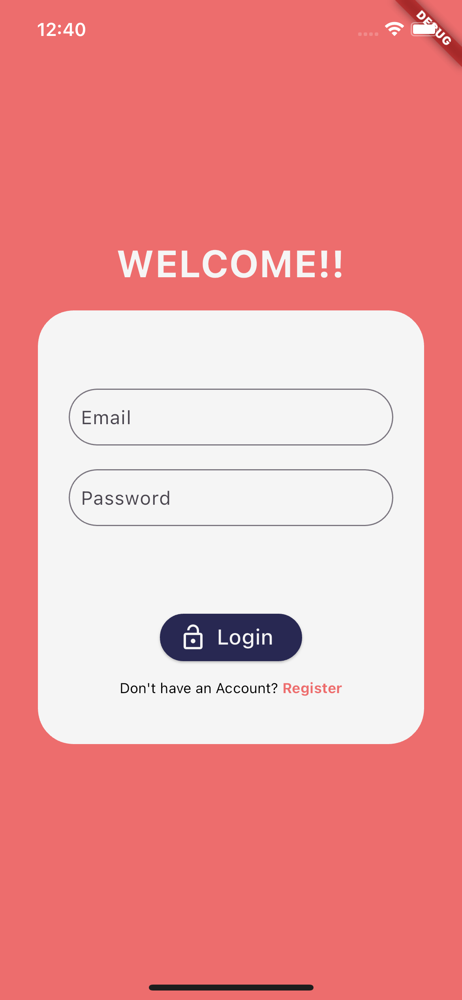
    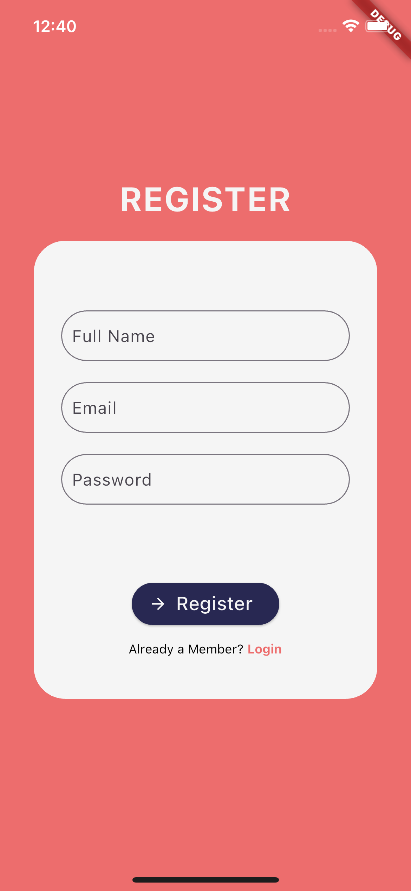

 

The main functionality of the app is represented on the home page where the user can see in real-time the chargers around him and get information about them. 

 

  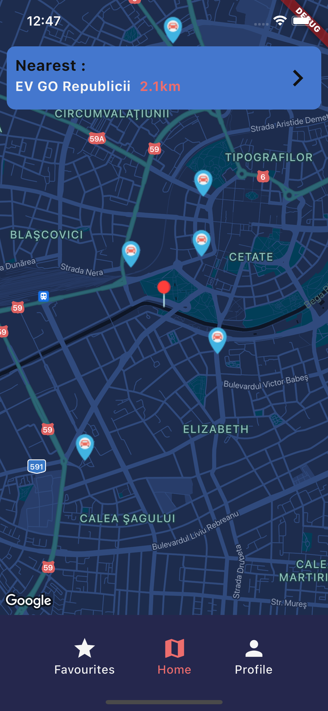
  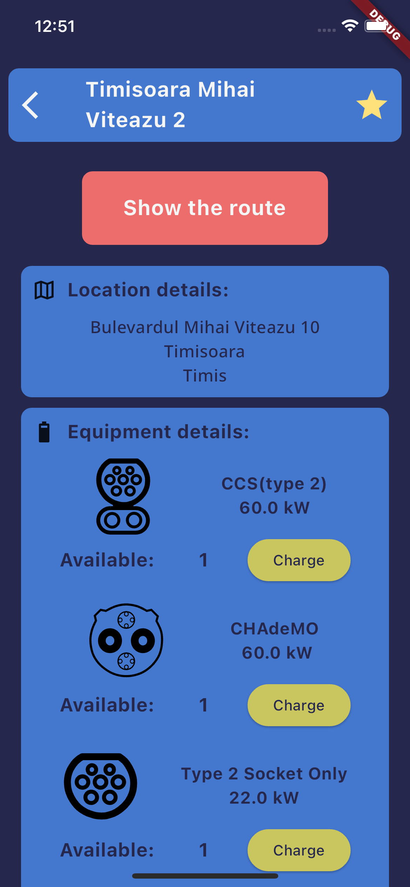

 

The chargers are pinned on the map and are displayed differently when the charger has no available connections.

 

  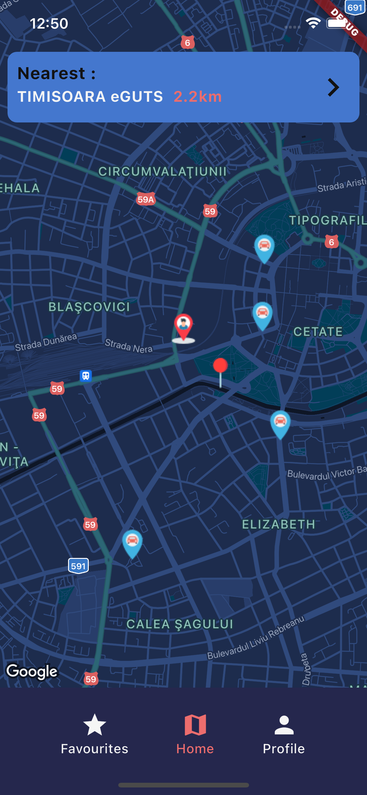

 

After finding the most wanted charger, the user can get directions to reach the charger and get some non-liquid fuel for his car. This can be achieved by pressing the **Show the route** button that shows the user (guess what) the route and gives him the option to navigate to the charger. The navigation to the charger will take place on the default map application of the phone.

 

  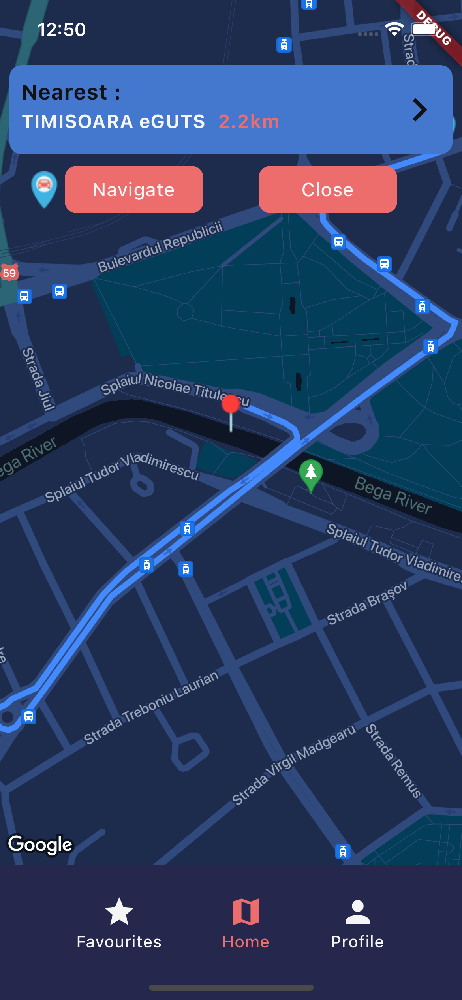

 

After the user reaches the charger he can occupy any connection available by pressing **Charge** on a connection available on the charger page. For now, we haven't integrate a validation method to verify if the user is really there, so he can troll us, but he would troll us with just one connection because the user is not allowed to occupy multiple connections at the same time.

The images below are showing the UI when the user is connected via a connection to a charger.

 

  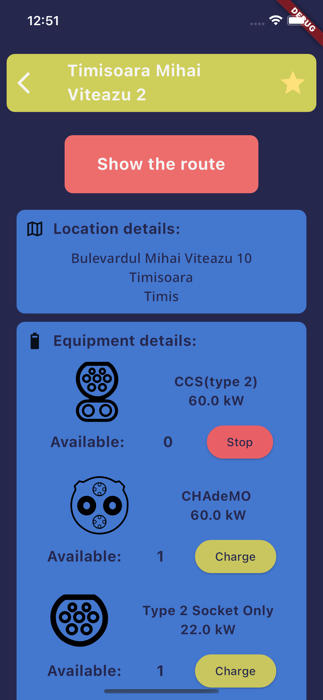
    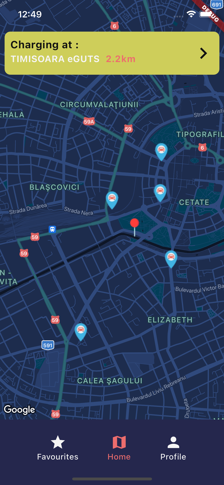

 

If a user enjoys a charger so much that he wants to have the information about it at first hand he can easily add it to his favorite page by pressing the star on the top left of the page. 

 

  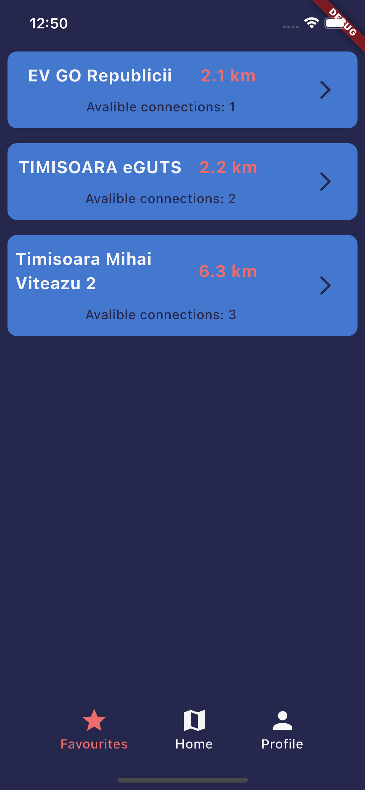

 

What if the user wants to see his profile? Again, we **⚡ElectricPark⚡**, got him covered because the app has a profile page where the user can change his profile picture, change his username, his email, and password.

The image below represents the profile page.

 

  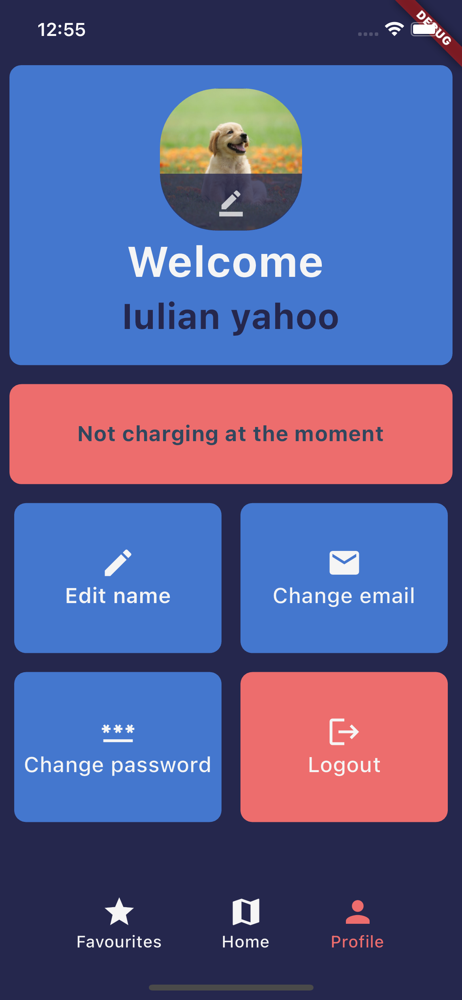

 

And the images below are representing the edit pages for everything mentioned above.

 

  
  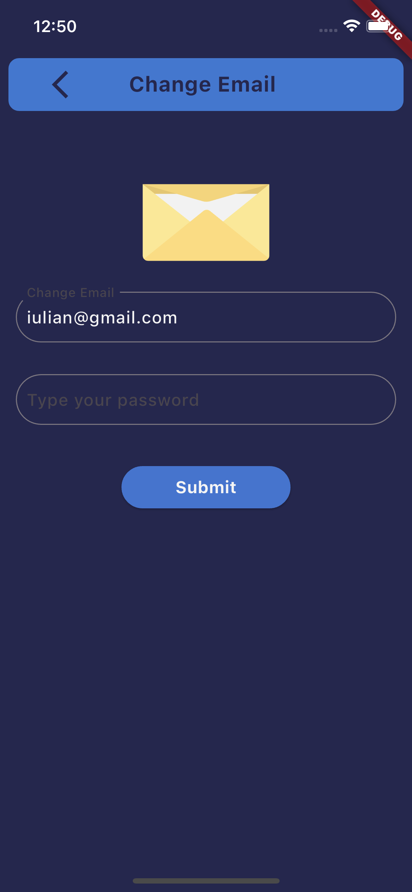
  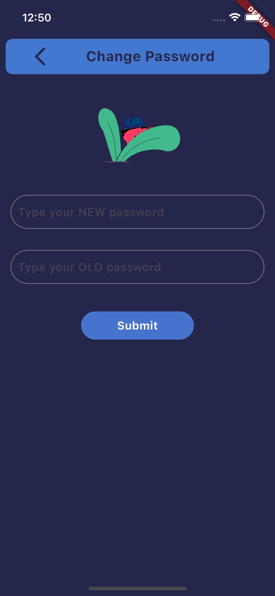

 

Below, you can see a *not slow at all* video that shows the entire app working (more or less).

 

  

 

## Tech used:

- Flutter
- Firebase for the Auth, Firestore and Firestorage
- GoogleMaps API for the map
- [Open Charge Map API for the information of chargers](https://openchargemap.org/site/develop/api#/)

## Problems faced/facing and next directions

### Problems:
- The integration of the map is not as smooth as I wanted and the home page is slightly lagging. To mention the the testing was made on an IOS simulator, so maybe the mentioned problem is irrelevant on a physical device.
- The *change map pin in real-time when a charger becomes unavailable* problem couldn't be solved by me, the reason being that the markers icons are updated in rendering the map
- Because of the map rendering id the user tries to change pages this time the app crashes
- The profile pic is not selected the first time (as shown in *the not slow at all* presentation of the app)

### Next directions:
- Fixing the problems mentioned above prioritizing the lag caused by the map loading on the home page.
- Adding a validation method so the user can't occupy a connection from a charger if his not there.
- Navigation in-app to reach a charger
- A way of predicting the time when a connection should be available by calculating the total time would need the current car connected to charge based on the connection power to charge. This would require the user to add details about his car.
